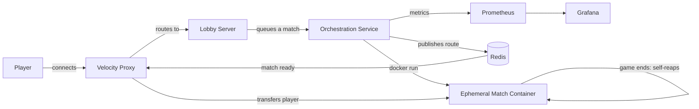

# Tower Defense — Distributed Minecraft Gamemode

A multiplayer tower defense gamemode for Minecraft (PaperMC), re-architected from a single-server
monolith into a **distributed system that provisions an ephemeral game server per match on demand**.
A lobby server provisions throwaway match containers through the Docker API, a Velocity proxy routes
players to them, and each match container tears itself down when the game ends — so idle compute is
never wasted. The whole system runs on a single homelab node and is fully observable through a
Prometheus + Grafana stack.

> Built and operated on an HP EliteDesk 800 G3 Mini (i5-6600T, 16 GB RAM) running Proxmox → Ubuntu →
> Docker. PaperMC 26.1.2 / Velocity 3.5 / Java 21–25.

## Why this is interesting

The interesting part isn't the game — it's the **on-demand match orchestration**. Rather than keeping
a fixed pool of game servers running (the typical approach, and what tools like Agones do with warm
pools), this system spins up a fresh, isolated container the moment a match is requested and destroys
it the moment the match ends. That trades a few seconds of cold-start latency for zero idle resource
cost — the right call for a RAM-constrained homelab, and a deliberate design decision rather than a
default.

## Architecture



**Components**

| Component | Role |
|-----------|------|
| **Velocity proxy** | Single entry point for players; routes them between lobby and match servers using modern forwarding. |
| **Lobby server** | A PaperMC server running the plugin in lobby mode; queues matches and provisions containers. |
| **Orchestration service** | Pure-JDK module inside the plugin: `docker run`s a match container, readiness-probes it, and publishes a route message to Redis. |
| **Match container** | An ephemeral PaperMC server that hosts exactly one match, then stops itself. |
| **Redis** | Pub/sub transport carrying "match ready" route messages from the lobby to the proxy. |
| **Prometheus + Grafana** | Scrape and visualize orchestration metrics (active matches, provision rate, boot time, failures, reaps). |

## Match lifecycle

A queued match flows through the system like this:

1. Players queue in the lobby. When the queue fills (or an admin force-starts), the lobby calls the orchestration service.
2. The orchestrator `docker run`s a match container on a shared Docker network, passing the match ID, map ID, and player roster as environment variables.
3. It readiness-probes the container by container name on the internal port until PaperMC accepts connections.
4. It publishes a `MatchRouteMessage` to Redis with the match's address and roster.
5. The Velocity router (subscribed to that Redis channel) registers the new server and transfers the rostered players to it.
6. The match plays out. The container clones the requested map, slots players into their arenas, and runs the game.
7. On game end the plugin emits a `[TD-LIFECYCLE] ENDED` sentinel; an in-container watchdog sees it, stops the JVM, and the container exits.

## Lifecycle management (four teardown cases)

A real concern with on-demand compute is leaked resources. This system handles four distinct teardown paths:

- **Normal end** (castle destroyed / forfeit / `/td stop`) → the plugin emits the lifecycle sentinel; the in-container watchdog stops the server.
- **Never got players** → a 45-second idle timeout fires; the container is left for the orchestrator's GC sweep.
- **Abandoned mid-match** (all players disconnect) → the plugin detects the empty server and routes through the same end path, so the container self-reaps.
- **Truly stuck containers** → a last-resort age-based GC sweep (2-hour threshold) in the orchestrator removes anything that somehow never self-terminated.

The active-match gauge is reconciled to the actual running-container count on every sweep, so it stays accurate regardless of how a container died.

## Observability

The plugin exposes a hand-written Prometheus exporter (JDK `HttpServer`, no third-party dependency) on
`/metrics`, scraped by Prometheus and visualized in a provisioned Grafana dashboard:

- `td_active_matches` (gauge) — live match container count
- `td_provision_successes_total` / `td_provision_failures_total` (counters)
- `td_boot_duration_millis_sum` / `_count` — for average match-server boot time
- `td_containers_reaped_total` (counter)
- `td_routes_published_total` (counter)

Grafana is reachable at `:3000`, Prometheus at `:9090`, and the raw metrics at `:9091/metrics`.

## Key design decisions

**On-demand provisioning over a warm pool.** A warm pool (Agones-style) keeps idle servers ready for
instant allocation, trading RAM for latency. On a 16 GB homelab that trade is backwards, so this
system provisions on demand and accepts a ~20-30s cold start. The cold start is hidden from players by
a lobby waiting experience.

**Docker CLI over the Docker Java API.** The orchestration module shells out to the `docker` CLI via
`ProcessBuilder` rather than pulling in the Docker-Java HTTP client. This keeps the module dependency-free
and pure-JDK, so it compiles into the plugin without touching the build's dependency tree.

**Container-name addressing on a shared network.** Match containers join the same user-defined Docker
network as the lobby and proxy, so they're reachable by container name on the internal port — avoiding
the `127.0.0.1`-vs-host pitfall of published-port addressing from inside another container.

**Self-terminating containers over external lifecycle management.** Each match server is the authority on
its own state, so it decides when to shut down (via the log sentinel + watchdog). The external GC sweep
is only a backstop, which keeps the happy path simple and the failure path safe.

## Tech stack

- **Game/plugin:** Java, PaperMC 26.1.2, Bukkit API
- **Proxy:** Velocity 3.5 (modern player forwarding)
- **Orchestration:** Pure-JDK (ProcessBuilder + Docker CLI), Redis pub/sub over raw RESP
- **Infra:** Docker + Docker Compose, Proxmox VE, Ubuntu Server
- **Observability:** Prometheus, Grafana
- **Build:** Maven (multi-module: plugin + Velocity router)

## Running it

The match-server image bundles PaperMC, the plugin, the tower NBT structures, and the mob-upgrade data.
Maps are bind-mounted read-only so they can be edited without rebuilding.

```bash
# Build the match-server image (build context is the repo root)
docker build -f docker/match-server/Dockerfile -t td-match:latest .

# Bring up the full stack: lobby, proxy, Redis, Prometheus, Grafana
cd docker/match-server
docker compose up -d
```

Players connect to the proxy on `:25565`. Grafana is on `:3000` (admin/admin).

## Repository layout
