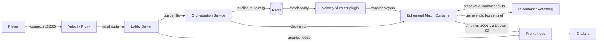

# Tower Defense — Distributed, On-Demand Minecraft Match Orchestration

A multiplayer tower-defense gamemode for Minecraft (PaperMC), re-architected from a single-server
monolith into a **distributed system that provisions a dedicated, ephemeral game server for every
match on demand**. A lobby server provisions throwaway match containers through the Docker daemon, a
Velocity proxy transparently routes players to them over a Redis control channel, and each match
container tears itself down the instant its game ends — so idle compute is never paid for. The entire
system is instrumented end-to-end with a two-layer Prometheus + Grafana observability stack and runs
self-hosted on a single Proxmox homelab node.

> **Runs on:** HP EliteDesk 800 G3 Mini (Intel i5-6600T, 16 GB RAM, ~256 GB SSD) → Proxmox VE → Ubuntu
> Server VM → Docker. **Stack:** PaperMC 26.1.2, Velocity 3.5, Java 21/25, Redis 7, Prometheus, Grafana.

---

## Table of Contents

1. [What this project is](#1-what-this-project-is)
2. [Why it's interesting](#2-why-its-interesting-the-core-idea)
3. [High-level architecture](#3-high-level-architecture)
4. [Components in detail](#4-components-in-detail)
5. [The match request lifecycle](#5-the-match-request-lifecycle)
6. [Container lifecycle management — the four teardown cases](#6-container-lifecycle-management--the-four-teardown-cases)
7. [Observability — two layers](#7-observability--two-layers)
8. [Key design decisions](#8-key-design-decisions)
9. [Engineering problems solved along the way](#9-engineering-problems-solved-along-the-way)
10. [Infrastructure & operations](#10-infrastructure--operations)
11. [Repository layout](#11-repository-layout)
12. [Build & deploy](#12-build--deploy)
13. [Configuration reference](#13-configuration-reference)
14. [Tech stack summary](#14-tech-stack-summary)

---

## 1. What this project is

At the gameplay level, this is a tower-defense gamemode: players defend a castle across waves of mobs,
building and upgrading towers, managing a gold economy, and (in multiplayer) sending mobs at an
opponent. It supports single-player and 2-arena multiplayer maps.

At the systems level — which is the focus of this document — it is a **match-orchestration platform**.
Instead of running all games on one large server, the system treats each match as a unit of compute to
be provisioned, isolated, monitored, and reclaimed. This is the same shape of problem that dedicated
game-server platforms (and, more broadly, any ephemeral-workload scheduler) solve, implemented from
first principles on a resource-constrained homelab.

## 2. Why it's interesting (the core idea)

The interesting part isn't the game — it's the **on-demand provisioning model**.

The conventional approach to multiplayer game hosting is a **warm pool**: keep a fixed number of game
servers running and idle, ready to accept a match instantly. This trades RAM (idle servers cost
memory) for latency (zero cold-start). Tools like Agones formalize this with Kubernetes.

This project deliberately makes the **opposite trade**. On a 16 GB homelab, holding idle servers in
reserve is the wrong use of scarce memory, so instead the system:

- keeps **only** the lobby, proxy, Redis, and monitoring running at baseline, and
- spins up a fresh, isolated match container **only when a match is actually requested**, then
- **destroys it the moment the match ends**, returning all its memory.

The cost is a ~20–30 second cold start per match, which is hidden from players by a lobby waiting
experience. The benefit is that idle resource cost is effectively zero — the box can host the baseline
services and burst to several concurrent matches without ever paying for capacity it isn't using. This
was a conscious capacity-planning decision driven by the hardware, not a default.

## 3. High-level architecture



Everything runs inside Docker on one Ubuntu VM. The lobby, proxy, Redis, Prometheus, and Grafana are
long-lived services defined in `docker-compose.yml`. Match containers are **not** in the compose file —
they are created programmatically at runtime by the lobby plugin and share the same Docker network so
they can be addressed by name.

## 4. Components in detail

### Velocity proxy (`velocity` service)
The single public entry point. All players connect to the proxy on port 25565. It runs Velocity 3.5
(build 605+, required because the player's Minecraft client is a modern version that older Velocity
builds reject) with **modern player-info forwarding** enabled. A small custom plugin, **td-router**
(separate Maven module, package `com.pauljang.towerdefense.velocity`), subscribes to a Redis channel
and performs the actual player transfers when a match becomes ready. On first connect, players are sent
to the lobby.

### Lobby server (`lobby` service)
A PaperMC server running the Tower Defense plugin in **lobby mode** (no `TD_MATCH_ID` env var set). It
presents the queue/matchmaking UI, and when a match should start, it calls the orchestration service to
provision a container rather than hosting the game itself. It mounts the host's Docker socket
(`/var/run/docker.sock`) so the plugin can issue Docker commands, and it exposes the orchestration
metrics endpoint on port 9091. It runs from a **persistent volume** (`./lobby-data/server`) so its
world and plugin JAR survive restarts.

### Orchestration service (`orchestration` package, inside the plugin)
The heart of the system. A pure-JDK module (no third-party Docker or HTTP client) that:
- provisions a match container by shelling out to the `docker` CLI via `ProcessBuilder`,
- TCP-readiness-probes the new container until PaperMC accepts connections,
- publishes a `MatchRouteMessage` (JSON) to Redis so the proxy transfers players,
- runs a periodic garbage-collection sweep for orphaned containers,
- reconciles an "active matches" gauge to the true running-container count,
- and exposes orchestration metrics on `/metrics`.

Key classes: `OrchestrationService` (glue + reaper + metrics lifecycle), `DockerMatchProvisioner`
(the actual `docker run`/`port`/`inspect`/`rm` logic and readiness probe), `MatchProvisioner`
(interface with default methods so alternative providers compile), `MatchInstance` / `MatchRequest`
(records), `MatchRouteMessage` + `RedisPublisher` (raw-RESP Redis publish), and `MetricsServer`
(the fleet-level Prometheus exporter).

### Match container (`td-match:latest` image)
An ephemeral PaperMC server that hosts exactly one match. Booted with `TD_MATCH_ID`, `TD_MAP_ID`,
`TD_PLAYER_UUIDS`, and `TD_VELOCITY_SECRET` env vars, it detects match-server mode on enable
(`maybeStartAsMatchServer`), clones the requested map template into a fresh world, waits for its
rostered players, activates the game, and — on game end — emits a log sentinel that a bundled watchdog
watches for to stop the server. The image bakes in PaperMC, the plugin JAR, the tower NBT structures,
and the mob-upgrade CSV; map templates are bind-mounted read-only so they can be edited without
rebuilding. Each container is labelled `td.matchId=<id>` for discovery and reaping.

### Redis (`redis` service)
A lightweight pub/sub transport. The lobby publishes "match ready" route messages on the
`td:match:route` channel; the Velocity td-router plugin subscribes and acts on them. Redis is used only
as a control-plane signal bus, not for persistent state.

### Prometheus (`prometheus` service)
Scrapes two things: the lobby's static orchestration endpoint, and — via **Docker service discovery** —
every live match container's own metrics endpoint. Mounts the Docker socket to enumerate containers.
Retention is capped at 15 days.

### Grafana (`grafana` service)
Visualizes both metric layers via a provisioned datasource and dashboard (no manual setup — the
datasource and dashboard JSON are mounted and auto-loaded on startup). Reachable on port 3000.

## 5. The match request lifecycle

1. **Queue fills.** Players join the queue in the lobby. When it reaches the match size (or an admin
   runs `/td forcestart`), the lobby's `GameManager.startMatch` delegates to
   `OrchestrationService.provisionAndRoute(matchId, mapId, singlePlayer, players)` because orchestration
   is enabled.
2. **Provision.** On a private daemon thread (never the main server thread — it does blocking I/O),
   `DockerMatchProvisioner.provision` builds and runs:
   `docker run -d --name td-match-<id> --label td.matchId=<id> --network td-net -P -e TD_MATCH_ID=... -e TD_MAP_ID=... -e TD_PLAYER_UUIDS=... -e TD_VELOCITY_SECRET=... td-match:latest`.
   Maps are bind-mounted read-only.
3. **Readiness probe.** Because all containers share the `td-net` network, the lobby reaches the new
   container **by its container name on the internal port 25565** (not the published host port, which is
   unreachable via `127.0.0.1` from inside another container). It opens a TCP socket in a loop until the
   match server accepts connections or a timeout is hit.
4. **Route publish.** The lobby publishes a `MatchRouteMessage` (match id, host=container-name,
   port=25565, roster) to Redis `td:match:route`.
5. **Transfer.** The Velocity td-router plugin, subscribed to that channel, registers the new backend
   server and transfers each rostered player to it via a connection request.
6. **Match starts.** Inside the container, the plugin (already in match-server mode) has cloned the map
   into a fresh world (`finishMatchServerStartup`), slots each arriving player into their arena, and —
   once the expected roster is present or a grace timeout fires — activates the match. Towers fire, waves
   spawn, the economy ticks.
7. **Match ends.** On any end condition, `handleMatchEnd` emits `[TD-LIFECYCLE] ENDED matchId=<id>` to
   the log exactly once. The bundled watchdog sees it and stops the JVM; the container exits and is
   removed.
8. **Return to lobby.** Finished players are sent back to the **real** lobby server through the proxy via
   a `Connect` plugin message (not teleported to the container's blank local lobby world — see §9).

## 6. Container lifecycle management — the four teardown cases

Leaked containers are the central risk of on-demand compute, so four distinct teardown paths are
handled explicitly:

1. **Normal completion** — castle destroyed, forfeit, or `/td stop`. `handleMatchEnd` emits the
   `[TD-LIFECYCLE] ENDED` sentinel; the in-container watchdog (`entrypoint.sh` + `match-watchdog.sh`,
   which tail the log) stops the server gracefully.
2. **Never occupied** — nobody ever connects. After a 45-second wait
   (`MATCH_SERVER_PLAYER_WAIT_SECONDS`), the container logs that it's idle and leaves itself for the
   external GC sweep.
3. **Abandoned mid-match** — all players disconnect from an active game. The plugin's quit/kick handlers
   call `checkMatchServerAbandoned`, which (once the last player is confirmed gone) routes through the
   same `handleMatchEnd` path, emitting the sentinel so the container self-reaps.
4. **Stuck / crashed** — a container that somehow never emits the sentinel (e.g. a hung JVM). The
   orchestrator's **reaper** — a `ScheduledExecutorService` running every 60 seconds — force-removes any
   `td.matchId`-labelled container older than a **2-hour** last-resort threshold. The threshold is high
   precisely because cases 1–3 handle all normal teardown; the reaper is only a backstop and must never
   kill a legitimately long match.

On every sweep, the reaper also **reconciles** the `td_active_matches` gauge to the actual count of
running match containers (`countRunning()`), so the gauge self-corrects within 60 seconds no matter how
a container died — including self-reaps the lobby never explicitly observed.

## 7. Observability — two layers

The system exposes metrics at two levels, both in Prometheus text format from hand-written exporters
using the JDK's built-in `com.sun.net.httpserver.HttpServer` (zero third-party dependencies).

### Layer 1 — Fleet / orchestration metrics (the lobby)
Served on `lobby:9091/metrics`, scraped as a **static target**. Tracks the provisioning system's
behavior:

| Metric | Type | Meaning |
|--------|------|---------|
| `td_active_matches` | gauge | Currently running match containers (reconciled to ground truth) |
| `td_provision_attempts_total` | counter | Provision attempts |
| `td_provision_successes_total` | counter | Successful provisions |
| `td_provision_failures_total` | counter | Failed provisions |
| `td_routes_published_total` | counter | Route messages published to Redis |
| `td_containers_reaped_total` | counter | Containers removed by the GC sweep |
| `td_boot_duration_millis_sum` / `_count` | counter | For average match-server boot latency |

The lobby exporter starts **lazily** on the first `provisionAndRoute` call (alongside the orchestration
worker), so on a freshly restarted, never-used lobby this target reads `down` until the first match is
queued. This is by design; it can be made eager if a `down`-means-broken invariant is preferred.

### Layer 2 — Per-match game-server metrics (each match container)
Each match container runs its own exporter (`MatchServerMetrics`) on `:9091/metrics`, started from
`finishMatchServerStartup` when the match world is ready. Because match containers are **ephemeral**
(random names, created and destroyed constantly), Prometheus finds them via **Docker service
discovery** (`docker_sd_configs`) rather than a static list: it enumerates all containers, keeps only
those carrying the `td.matchId` label, rewrites the scrape address to the container's `td-net` IP on
port 9091, and labels each series with `match_id`. Containers are auto-registered when they start and
dropped when they stop.

| Metric | Type | Meaning |
|--------|------|---------|
| `td_match_tps{match_id}` | gauge | Server ticks per second (1-min avg, capped at 20) |
| `td_match_players_online{match_id}` | gauge | Players connected to that match |
| `td_match_heap_used_bytes{match_id}` | gauge | JVM heap in use |
| `td_match_heap_max_bytes{match_id}` | gauge | JVM max heap |

### Grafana
One provisioned dashboard, "Tower Defense Orchestration," with fleet panels (Active Matches, Total
Provisions, Provision Failures, Containers Reaped, Avg Boot Duration, Provision Rate) and per-match
panels (Match TPS, Players Online, Heap Used — each broken out by `match_id`, so concurrent matches
appear as separate series that come and go live).

Endpoints: Grafana `:3000` (admin/admin), Prometheus `:9090`, raw fleet metrics `:9091/metrics`.

## 8. Key design decisions

**On-demand provisioning over a warm pool.** The defining trade. Idle servers cost RAM the homelab
doesn't have to spare, so the system provisions per-match and eats a cold start instead. (See §2.)

**Docker CLI over the Docker Java API.** The orchestration module shells out to the `docker` binary via
`ProcessBuilder` instead of pulling in a Docker-Java HTTP client. This keeps the module pure-JDK and
dependency-free, so it compiles straight into the plugin without touching the build's dependency tree.
The tradeoff — the `docker` binary must exist inside the lobby container — is handled by installing
`docker.io` in the image.

**Container-name addressing on a shared network.** Match containers join the same user-defined
`td-net` network as the lobby and proxy, so they're reachable by container name on the internal port
25565. This sidesteps the trap where a published host port (`0.0.0.0:3xxxx`) is not reachable via
`127.0.0.1` from *inside* another container.

**Self-terminating containers over external control.** Each match server is the authority on its own
state and decides when to stop (log sentinel → watchdog). The external reaper is only a backstop. This
keeps the happy path simple and the failure path safe, and avoids the lobby having to track and command
every container's lifecycle.

**Flat, single-layout world templates.** PaperMC 26.1.2's world-migration refuses to run when a world
has both a legacy top-level `region/` and a nested `dimensions/minecraft/overworld/region/`. Templates
are kept in a single top-level layout matching the migrator's expectations (see §9).

**Hand-written exporters over a metrics library.** Both exporters are ~100 lines of JDK `HttpServer`
producing Prometheus text format directly. No Micrometer/Prometheus-client dependency, full control
over metric names and semantics, and consistent style across both layers.

## 9. Engineering problems solved along the way

A non-exhaustive record of real problems hit and fixed — the texture behind the clean architecture:

- **PaperMC API download endpoint changed.** The old `api.papermc.io/v2` stopped serving builds; the
  Dockerfile now uses `fill.papermc.io/v3` and parses the build's download URL with `jq`.
- **`docker` binary missing in the lobby container.** The plugin shells out to `docker`, so `docker.io`
  is installed in the image's runtime stage.
- **Match containers on the wrong network.** They were landing on the default `bridge`, so the lobby
  couldn't resolve them by name (`Temporary failure in name resolution`). Fixed by adding
  `--network td-net` to the run command; readiness now probes the container name on the internal port.
- **Persistent volume clobbered the freshly built JAR.** The lobby loads its plugin from a persistent
  volume, so a plain image rebuild didn't update it. Deploy now copies the new JAR into the volume after
  each build (`docker cp` from a throwaway container).
- **Velocity forwarding-secret mismatch.** The match server rejected proxied connections
  (`Unable to verify player details`) until the plugin's `velocity-secret`, the container's
  `TD_VELOCITY_SECRET`, and the proxy's `forwarding.secret` were made identical.
- **Map ID didn't resolve in the container.** The `maps-dir` config pointed at an in-container path that
  Docker couldn't bind-mount; it was set to the real host path.
- **Players sent to the wrong lobby on match end.** Both the compass return path
  (`returnToLobbyFromMatch`) and `/td stop` (`endMatch`) teleported players to the container's blank
  local `lobby_world` instead of the real lobby. Fixed by detecting match-server mode and sending
  players back through the proxy with a `Connect` plugin message — and by suppressing a *second*
  teleport in `endMatch`'s world-teardown step that was overriding the proxy send.
- **PaperMC 26.1.2 world-migration crash.** Single-player templates carried both legacy and nested world
  layouts, so the migrator refused to overwrite. Fixed by flattening templates to a single top-level
  layout (matching the working multiplayer maps).
- **Prometheus Docker SD label casing.** Docker SD does **not** lowercase label names — it only replaces
  `.` with `_`. So `td.matchId` becomes `__meta_docker_container_label_td_matchId` (capital `I`), not
  `..._td_matchid`. The relabel `keep` silently dropped every target until the casing was corrected.
- **Disk exhaustion from repeated `--no-cache` rebuilds.** The VM's 14 GB root filled to 100%, which
  truncated a config file mid-write (a 0-byte `prometheus.yml`) and corrupted Prometheus's WAL with a
  SIGBUS crash. Resolved by pruning build cache/containers, then preventing recurrence with a Docker
  builder GC cap and a Prometheus retention cap (see §10).

## 10. Infrastructure & operations

**Virtualization.** Proxmox VE on the EliteDesk hosts the VM(s). The Minecraft VM has a static IP, a
fixed resource allocation, and **Start at boot** enabled. A separate VM hosts a static portfolio site
(Caddy) and is exposed publicly via Cloudflare Tunnel (no port forwarding).

**Reboot resilience.** Docker is enabled at boot; all baseline services use `restart: unless-stopped`,
so they return automatically after a host or VM reboot. The Docker socket is made group/world-readable
persistently via a systemd drop-in (`/etc/systemd/system/docker.socket.d/override.conf`,
`SocketMode=0666`) so the lobby can talk to the daemon after a reboot without manual `chmod`. This was
verified by a full reboot test: socket permissions persisted and every container came back up.

**Disk-growth controls.** Two set-and-forget caps prevent the disk-fill failure mode from recurring:
- **Docker build cache** capped via `/etc/docker/daemon.json` → `builder.gc.defaultKeepStorage: "3GB"`.
- **Prometheus retention** capped via `--storage.tsdb.retention.time=15d` in the compose `command`.

Diagnostics: `df -h /` for overall disk, `docker system df` for Docker's share.

**Remote access.** For a semi-public / allowlist server, the intended access model is **Tailscale** —
players are invited into a private tailnet and reach the server at its Tailscale IP (or a MagicDNS
hostname), with nothing exposed to the public internet. The in-game allowlist provides a second,
independent layer.

## 11. Repository layout

```
src/main/java/com/pauljang/towerDefense/
├── TowerDefense.java                     # Plugin entry point (onEnable/onDisable, channel + metrics wiring)
├── core/
│   ├── GameManager.java                  # Game state, match lifecycle, match-server mode, lobby return
│   ├── MatchServerMetrics.java           # Per-match Prometheus exporter (TPS/players/heap)
│   └── ...                               # Match, GameState, wave/economy logic
├── orchestration/
│   ├── OrchestrationService.java         # Provision glue, reaper loop, metrics lifecycle
│   ├── DockerMatchProvisioner.java       # docker run/port/inspect/rm, readiness probe, reap, count
│   ├── MatchProvisioner.java             # Interface (default reapStale/countRunning)
│   ├── MetricsServer.java                # Fleet-level Prometheus exporter
│   ├── MatchInstance.java / MatchRequest # Records
│   ├── MatchRouteMessage.java            # JSON route payload
│   └── RedisPublisher.java               # Raw-RESP Redis publish
├── listeners/                            # Event handlers (join/quit/kick, interactions)
└── towers/ , entities/ , data/ ...       # Gameplay systems

velocity-plugin/                          # Separate Maven module: the Velocity td-router plugin
docker/match-server/
├── Dockerfile                            # Builds td-match:latest (Paper + plugin + structures + CSV)
├── entrypoint.sh / match-watchdog.sh     # In-container boot + lifecycle-sentinel watchdog
├── docker-compose.yml                    # lobby, velocity, redis, prometheus, grafana + td-net
├── prometheus.yml                        # Static lobby target + Docker SD for match containers
├── grafana/provisioning/                 # Datasource + dashboard (auto-loaded)
├── plugin-data/structures/               # 53 tower NBT structures baked into the image
└── mob_upgrades_polymorphic.csv          # Mob upgrade data baked into the image

GAME_WORLD_TEMPLATES/
├── SINGLE_PLAYER/sp_map1_classic/        # Bind-mounted map templates (flat top-level layout)
└── MULTI_PLAYER/mp_map1_classic, mp_map2_classic2/
```

## 12. Build & deploy

The match-server image bundles PaperMC, the plugin, the tower NBT structures, and the mob-upgrade CSV.
The build context is the repository root.

```bash
# 1. Build the plugin + match-server image
docker build -f docker/match-server/Dockerfile -t td-match:latest .

# 2. Copy the freshly built plugin JAR into the lobby's persistent volume
#    (the lobby loads its plugin from the volume, not the image)
docker create --name td-temp td-match:latest
docker cp td-temp:/opt/td-server/plugins/Tower_Defense.jar \
          docker/match-server/lobby-data/server/plugins/Tower_Defense.jar
docker rm td-temp

# 3. Bring up (or refresh) the full stack
cd docker/match-server
docker compose up -d
```

Players connect through the proxy on `:25565`. Grafana is on `:3000`. Use a plain `docker build`
(cached) for normal iteration; reserve `--no-cache` for when a stale layer is actually suspected.

To op yourself on an offline-mode match/lobby server:
`docker exec -i <container> bash -c 'echo "op <name>" > /tmp/td-console'`.

## 13. Configuration reference

**Plugin `config.yml` — `orchestration:` block**
- `enabled` — turns the whole on-demand flow on; when false the plugin uses its classic single-server flow.
- `match-image` — the image to run per match (`td-match:latest`).
- `maps-dir` — **host** path to `GAME_WORLD_TEMPLATES` (must be a host path Docker can bind-mount).
- `velocity-secret` — must match the proxy's `forwarding.secret` and the container's `TD_VELOCITY_SECRET`.
- `redis.host` / `redis.port` — the control-plane Redis.

**Match container env vars** (set by the provisioner)
- `TD_MATCH_ID`, `TD_MAP_ID`, `TD_PLAYER_UUIDS`, `TD_VELOCITY_SECRET`.

**Orchestration tunables** (`OrchestrationService`)
- `REAP_PERIOD_SECONDS = 60` — reaper sweep interval.
- `REAP_MAX_AGE_SECONDS = 7200` — last-resort age threshold (2 h).
- `METRICS_PORT = 9091` — exporter port (both layers).

**Server tuning**
- `view-distance` / `simulation-distance` in `docker/match-server/server.properties` (baked into the image).

## 14. Tech stack summary

- **Game / plugin:** Java, PaperMC 26.1.2, Bukkit API
- **Proxy:** Velocity 3.5 (modern forwarding), custom Redis-driven router plugin
- **Orchestration:** Pure-JDK (`ProcessBuilder` + Docker CLI), Redis pub/sub over raw RESP
- **Containerization:** Docker, Docker Compose, user-defined bridge network, Docker service discovery
- **Observability:** Prometheus (static + Docker SD), Grafana (provisioned), hand-written JDK exporters
- **Infrastructure:** Proxmox VE, Ubuntu Server, systemd, Caddy (portfolio VM), Cloudflare Tunnel, Tailscale
- **Build:** Maven (multi-module: Paper plugin + Velocity router)
